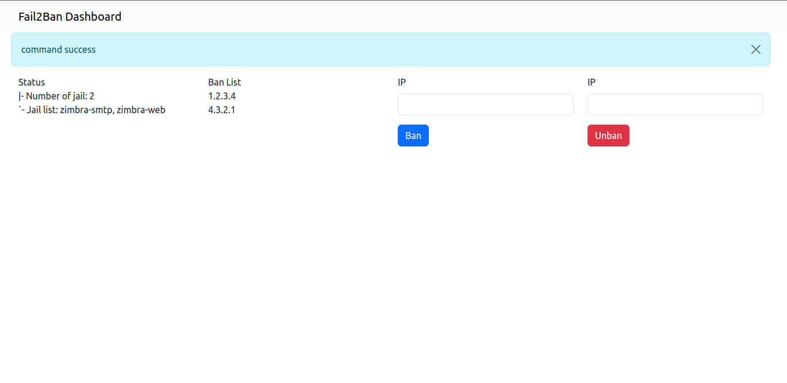

# README
Fail2ban admin panel in flask app


# Fail2Ban Panel




## Prerequisites

- Install docker and docker compose
- Install git


## Installation

```bash
git clone https://github.com/mauro25987/fail2ban_flask.git
cd fail2ban_flask
```

- edit file .env
- exclude ROUTE1, ROUTE2 default routes for server fail2ban.
- HOST is IP Server fail2ban
- JAIL is for bans for fail2ban

```bash
docker compose build
docker compose up -d
docker exec -it fail2ban_flask bash
```

```bash
ssh-keygen -t rsa
ssh-copy-id -i /root/.ssh/id_rsa.pub root@ipfail2ban
```
